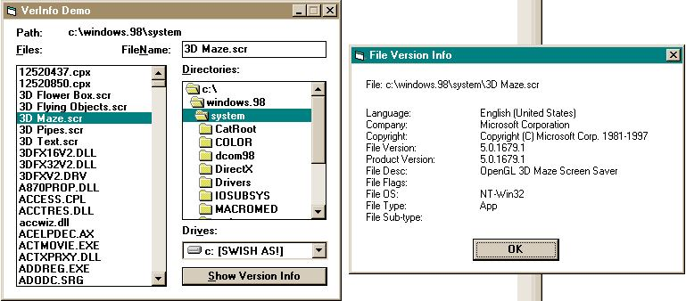

<div align="center">

## InstallFile module \- Install files on end user's machine w/o copy older version over a new version\.


</div>

### Description

When installing a file on an end user's machine, you should not copy an older version of the file over a new version.

The InstallFile wrapper in the InstFile.bas module uses the VerFindFile and VerInstallFile API functions provided by Version.dll to copy files to the user's machine, and will not overwrite an existing file with an older version.

The InstFile.bas module requires the GetVersionInfo wrapper in the VerInfo.bas module (also included) which uses several API functions also provided by Version.dll, most importantly the GetFileVersionInfo function.
 
### More Info
 


<span>             |<span>
---                |---
**Submitted On**   |2004-09-07 18:29:50
**By**             |[Rde](https://github.com/Planet-Source-Code/PSCIndex/blob/master/ByAuthor/rde.md)
**Level**          |Intermediate
**User Rating**    |5.0 (10 globes from 2 users)
**Compatibility**  |VB 5\.0, VB 6\.0
**Category**       |[Coding Standards](https://github.com/Planet-Source-Code/PSCIndex/blob/master/ByCategory/coding-standards__1-43.md)
**World**          |[Visual Basic](https://github.com/Planet-Source-Code/PSCIndex/blob/master/ByWorld/visual-basic.md)
**Archive File**   |[InstallFil1792109112004\.zip](https://github.com/Planet-Source-Code/rde-installfile-module-install-files-on-end-user-s-machine-w-o-copy-older-version-over-a-n__1-53446/archive/master.zip)

### API Declarations

```
Several declares to version.dll in modules
18k zip
```


